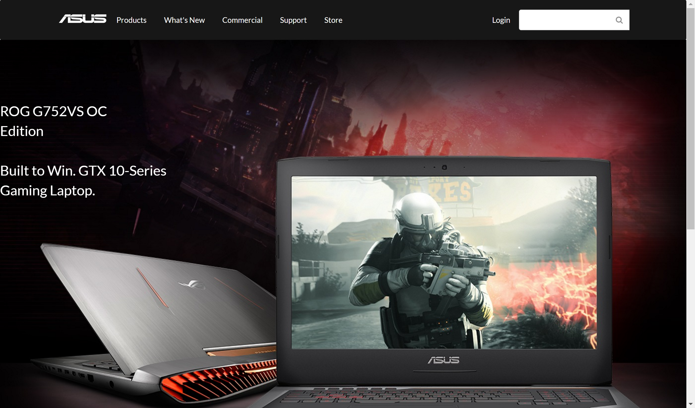

During my time studying computer science there has always been one rule that I try to follow, and that is to make sure
it works. I always put the function of a program before the looks of it. So what happens now that the appearance is the program?
Slowly I'm learning the importance of appearance, but I'm also learning that it's not so easy. UI Frameworks adds a different element to
html/css coding. I feel that you're able to make sites look even better. My first time learning to build website was my junior year of high 
school using Dreamweaver compared what I've learned now, it looks better by 10 folds. Learning Semantic UI hasn't been easy, but not impossible. It's kind
of like learning to ride a bicycle. You start off with the basics just like training wheels and as you get more comfortable you go on to more
complicated concepts. You may fall over a few times and get discouraged, but you just have to keep going and eventually it becomes easier. I'm
not saying that I'm an expert on UI Frameworks, but I am definitely better than when I first started.

