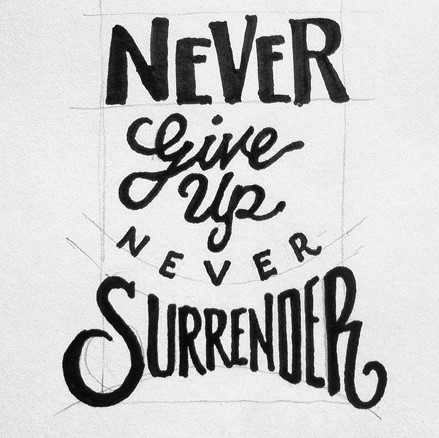

Never give up, never surrender. A phrase that I first heard from a film back in 1999. This film was called Galaxy Quest. This film was suppose to make fun of sci-fi and fantasy films like Star Trek. Although this film was meant to be a comedy, that phrase is one of great importance. Software Engineering isn't something that came easily to me. From the start I knew it was going to be a challenge. As more challenges arised, I found myself feeling that I wasn't good enough. As tough as things got, I knew that I had to keep pushing forward. At the end of the day at least I can say is I tried. What is success without failure right? As much as I don't want to fail, sometimes failure is a good thing. We are human after all. As a software engineer we have to take those failures and grow from them. We have to grow, just like the applications that we build.

I've met many who were pursuing the same goals as I am, but not succeed and give up. When I look back at those times, I wish I had told them to stick through it. As rough as things can get, you can't let that stop you from trying to reach your goals and dreams. So as time moves forward so will I. I will take every experience, good or bad to develop something that will be of us to others. As well as something that I can be proud of. Somethings that shows how I have grown as a software engineer.
