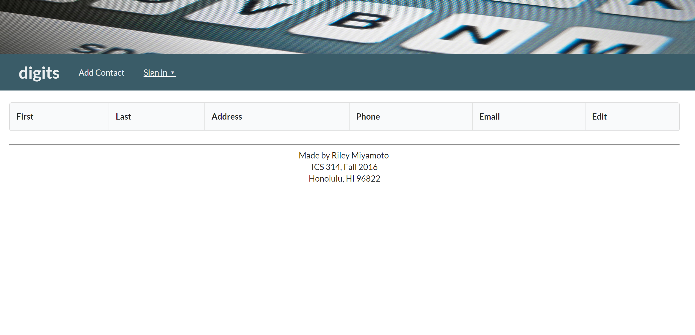

So where to begin with Meteor? First off I'd like to say is that I still have all my hair. Secondly I think I'm starting to like meteor.
Getting into Meteor was simple, nothing too out of the ordinary. As I dove furhter I found that the learning curve wasn't so nice. It took 
some time to get use to it, but looking back on it now, it's not so bad. Unless you count the amount of time on the internet trying to get it
to work. Setting that aside I did have some fun using meteor. What I found most interesting about meteor is the way information is handled.
In traditional ways information was stored on a server and a client would make a request to retrieve the data. In meteor the portion of which 
the client wants to retrieve is taken from the server and placed on the server. This method in my opinion is a much more efficient and reliant
way of altering data. 

