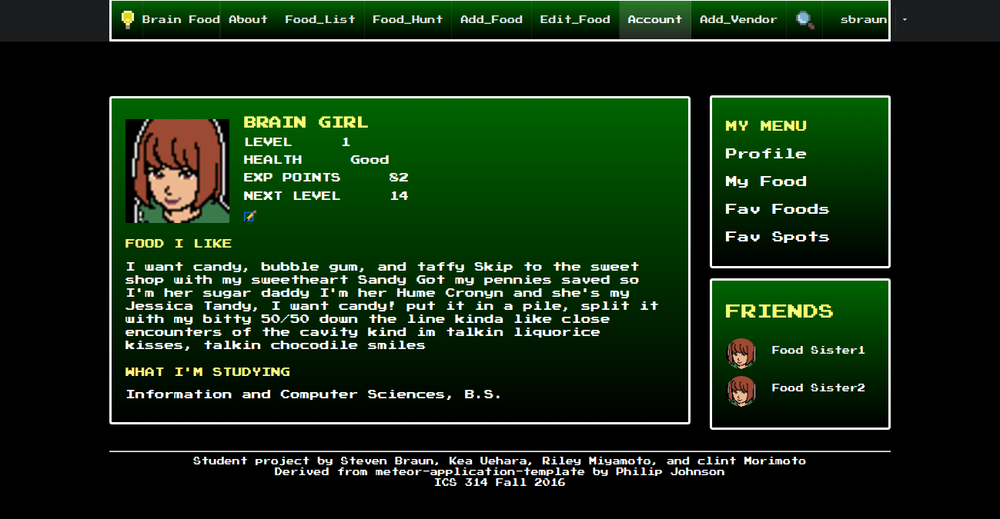
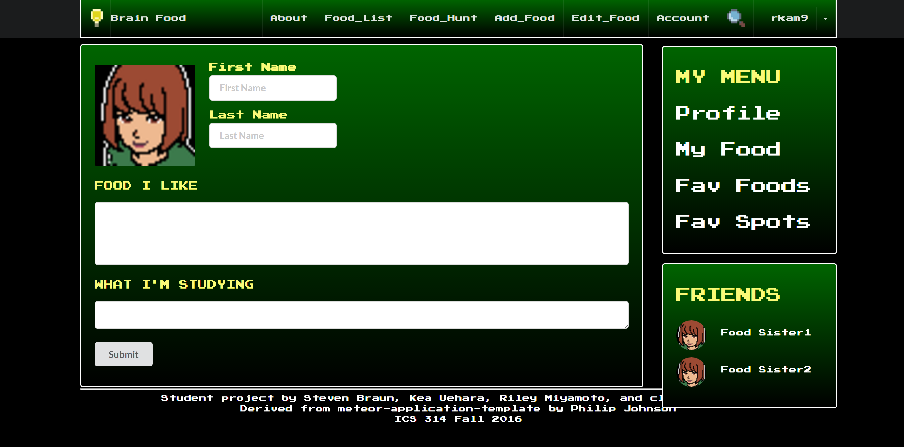
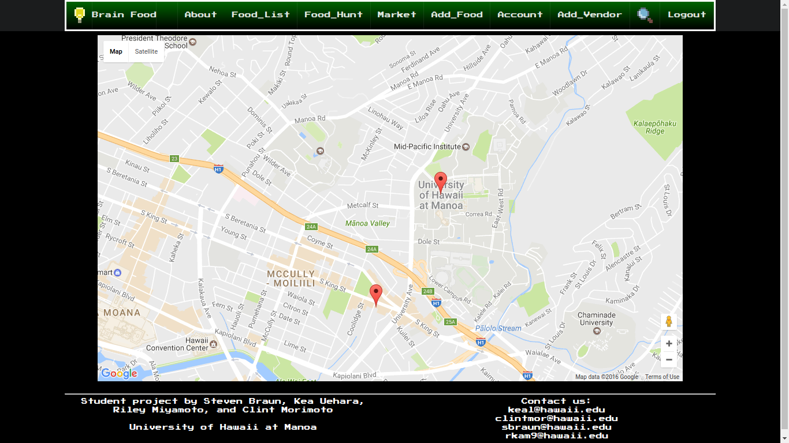

As a final project for ICS 314, software engineering, myself and three other classmates were tasked with creating a web application. The team members that I worked with were Clint Morimoto, Kea Uehara and Steven Braun. Our application is called Brain Food. This application's purpose was to allow students attending UH at Manoa create and post recipes that others could see. The recipes were to utilize the limited equipment that dorming students had at their disposal. The end product, was an almost fully functional application. It allowed users to post different recipes and look at recpies that other students posted. It also allowed students to find where vendors were located.

As for my personal contributions, I was tasked with adding the Google Maps API that showed where vendors were located. As well as personal account information and design fixes. There were many challenges that I faced with these tasks. The Google Maps API package that I used was from David Burles. He created a package for Meteor that allowed for the API. With this I made some small changes to incorporate it into the project. As for the account information, it wasn't fully complete. This is my one regret with the application. The account page is suppose to allow users to edit their account information. Information like their name, major and interests. Even with it's flaws I was still happy with the results. A lot of credit has to go with my project members, who made it possible.

Account Page
 

Edit Account Page
 

Google Maps Page

