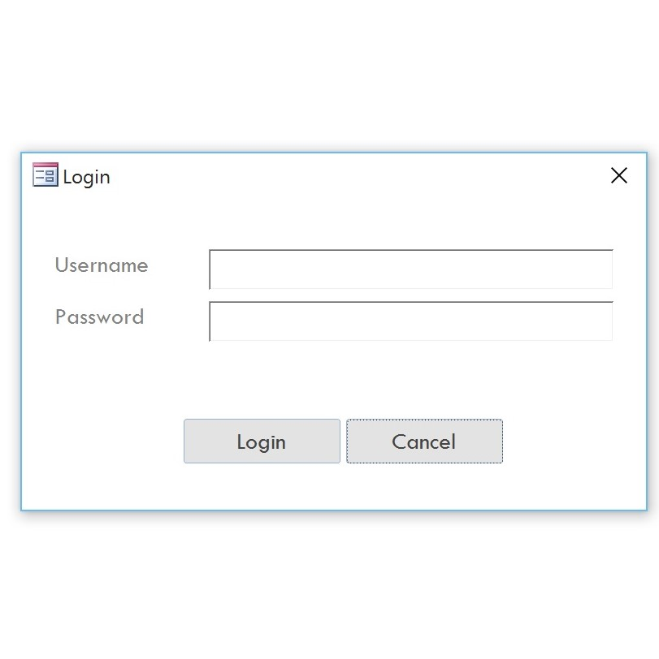
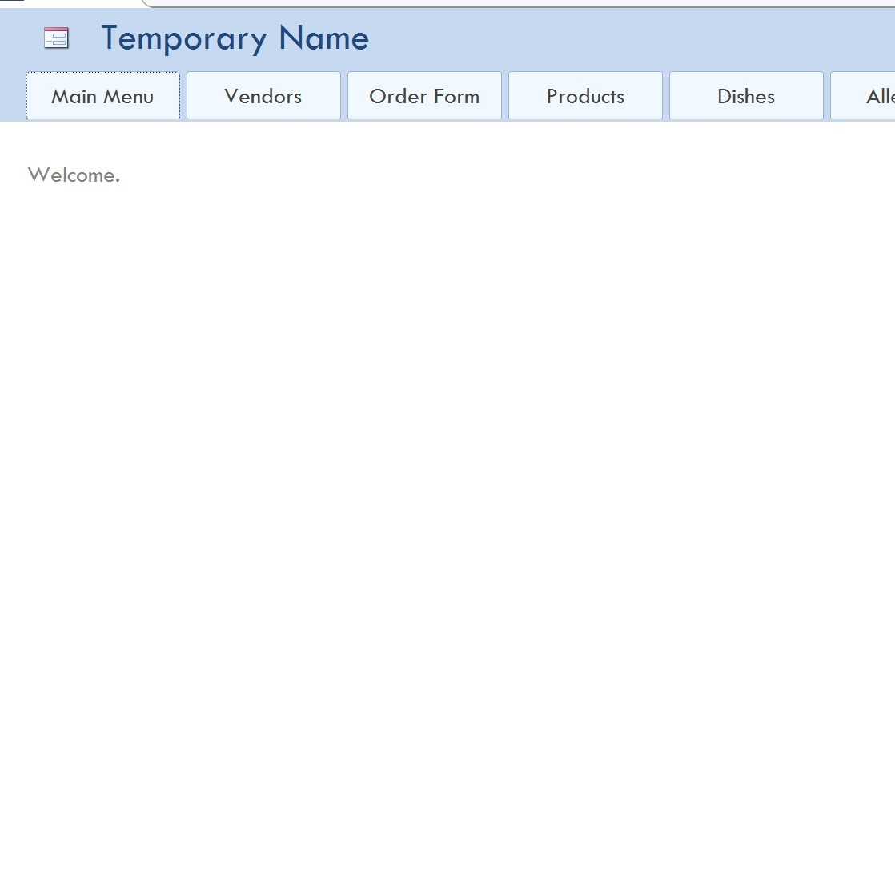

At Leeward Community College for the class ICS 270, we were tasked with creating a database for a company. Our base program we were given to build it was Microsoft Access. We were also allowed to use other programs with it, so we chose to go with Microsoft Excel. We used Excel as the back end of the database, which information was stored. Access was used for the calculations as well as building forms and reports. We also created a manual for both users and technicians. The user manual explained how the front end of the database worked and the technicians manual explained how the back end was built.

For this project, I was the team manager. I was responsible for planning the development process, which included setting dates for the completion of each task. I was as well incharge of keeping all members on track with the dates that were set. As a team we learned how to communicate with each other so that we can reach our end goal.

[Access file:] (https://RileyMiyamoto.github.io/RileyMiyamoto.github.io/downloads/FinalProjectUpdate.accdb)
[Excel file:] (https://RileyMiyamoto.github.io/downloads/AccessBackend.xls)

