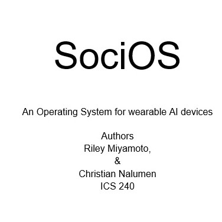

My teams operating system was designed to be a plausible system that could actually be built.

In order for us to create this plausible operating system we had to do research on each component. This meant we researched what it took to create a linux operating system.

 
