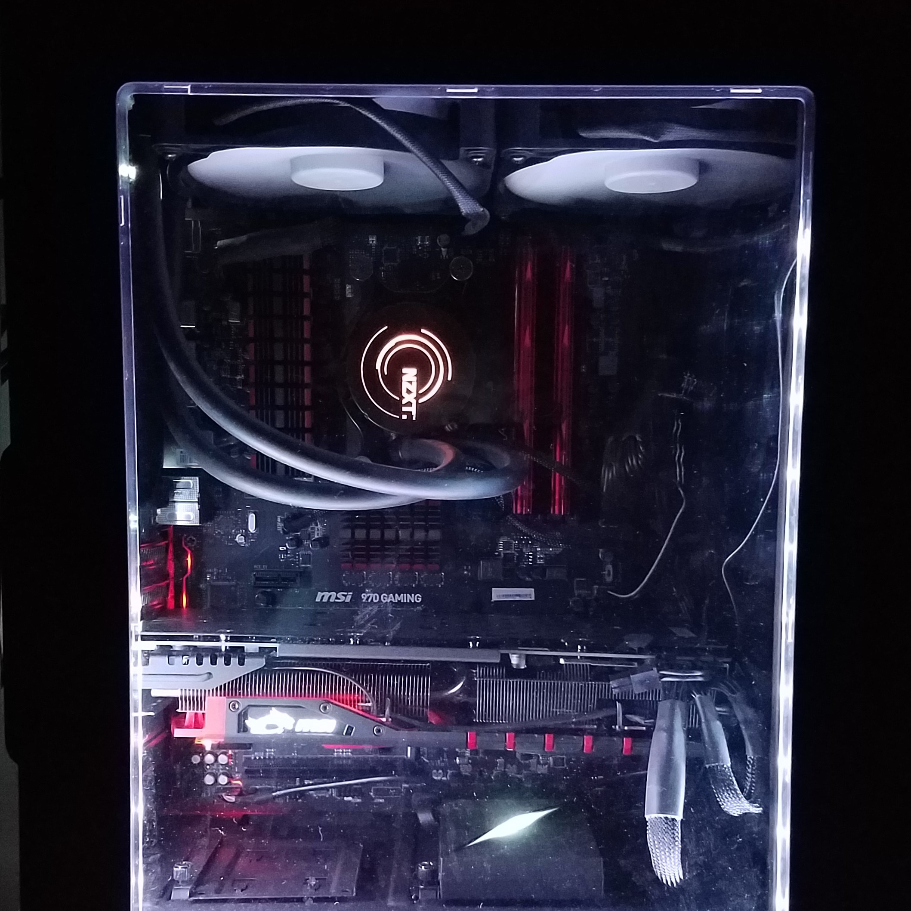

During my summer break I decided to build myself a new personal computer. Since newer technology is releasing ever so fast, it was time I built a new computer because I like to keep current with new techonolgies that come out. This project took about a couple of week to plan out because I chose my parts according to the performance I wanted. I also took this opportunity to teach others how to build computers. Two of my co-workers were interested in how computers are built. One more than the other since he was a computer science major who just started his degree.

What was interesting about this build for me personally was using liquid cooling. I don't like the idea of circulating water inside a box with electrical part, but I decided to try it since I hadn't before. After a few mishaps I finished the build with my co-workers. This project gave me some experience in teaching others about how a computer works and what goes into them. It also taught me that though there are mishaps, sometimes you need to think outside of the box to fix them.
